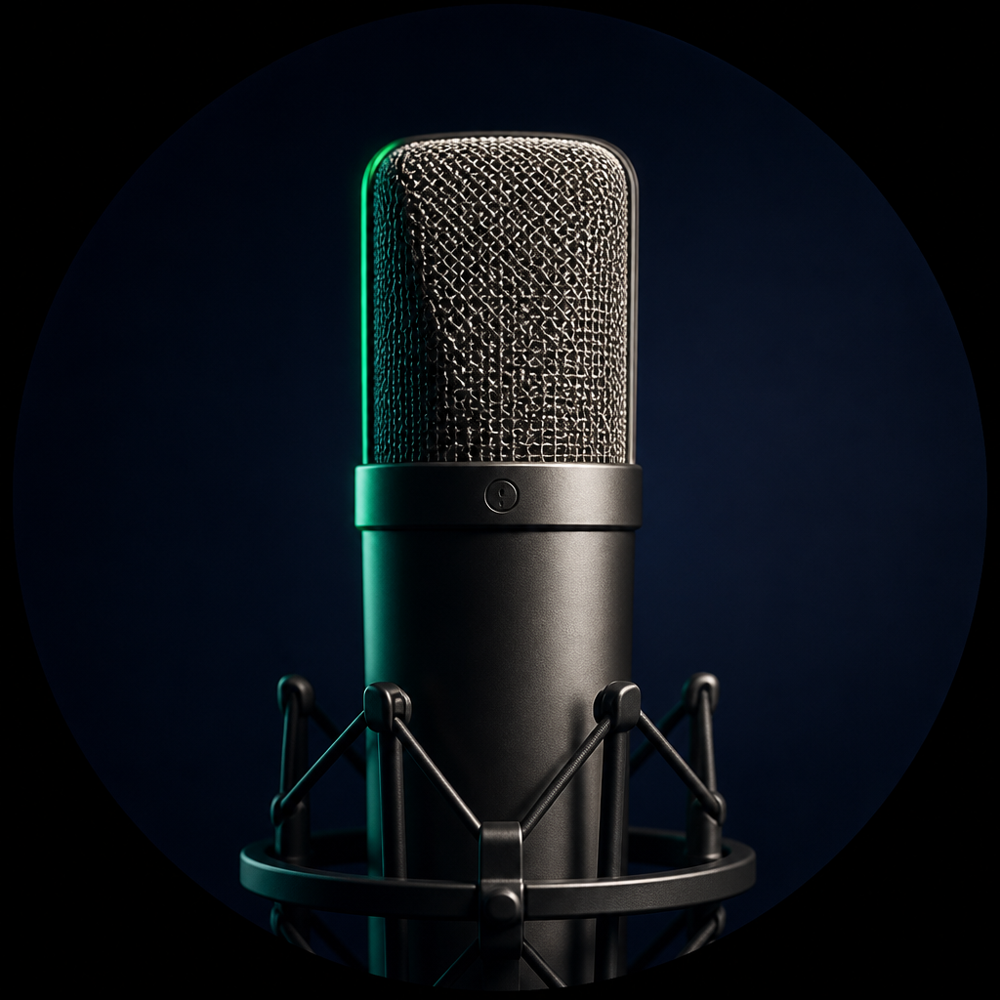
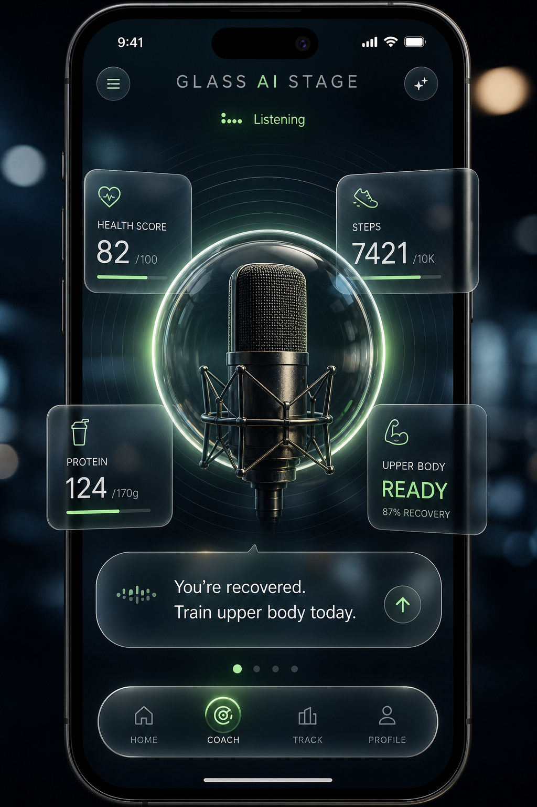
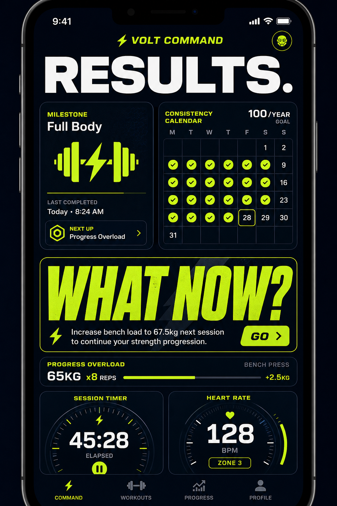
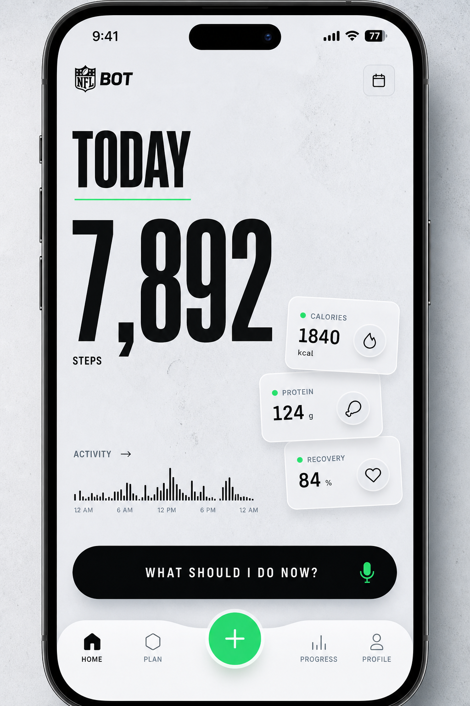

<p align="center">
  
</p>

<h1 align="center">NFL BOT</h1>
<p align="center"><strong>AI Health Coach · Glass AI Stage</strong></p>

<p align="center">
  One app for movement, training, nutrition, recovery — and a live AI coach that answers<br/>
  <em>“Given everything about me today, what should I do next?”</em>
</p>

<p align="center">
  <a href="https://github.com/Arnold-RG/nfl-bot/actions/workflows/ci.yml"></a>
  
  
  
  
  
</p>

<p align="center">
  <a href="#-glass-ai-stage">Product</a> ·
  <a href="#-features">Features</a> ·
  <a href="#-architecture">Architecture</a> ·
  <a href="#-quick-start">Quick start</a> ·
  <a href="#-documentation">Docs</a> ·
  <a href="#-roadmap">Roadmap</a>
</p>

---

## ✨ Glass AI Stage

The signature experience: a **photoreal live mic** inside a frosted glass interface — readiness, steps, protein, and training status orbit the coach.

<p align="center">
  
</p>

| Home — Glass Stage | Train — Volt command | Daylight activity |
|:---:|:---:|:---:|
|  |  |  |

> **Wellness only** — NFL BOT provides fitness guidance and is **not** a medical device or substitute for clinical care.  
> Trademark note: validate commercial use of “NFL” naming before store launch.

---

## 🚀 Features

| Module | Highlights |
|--------|------------|
| **🏠 Home** | Glassmorphism dashboard, live mic orb, Health / Steps / Protein / Recovery cards |
| **🏋️ Train** | Dark progressive-overload UI, milestones, muscle recovery, workout sessions |
| **🍽 Nutrition** | Macros, meal logging, AI food camera estimates (editable before save) |
| **📈 Track** | Progress, streaks, challenges |
| **🎙 Coach** | Voice + chat; **Health Data Platform** answers first, LLM only when needed |
| **⌚ Devices** | Watch pairing hub (Health Connect / wearables path) |
| **🔐 Privacy** | Permission center, AI memory reset, export/delete stubs |

**Product loop**

```text
Wake → health context → AI status → eat / train / move → recovery updates → daily summary → return tomorrow
```

---

## 🏗 Architecture

```text
                    NFL BOT
                       │
        ┌──────────────┼──────────────┐
   ACTIVITY         TRAINING       NUTRITION
        └──────────────┼──────────────┘
                 RECOVERY ENGINE
                       │
              AI ORCHESTRATOR  (+ safety layer)
                       │
           HEALTH DATA PLATFORM  ← single user profile
                       │
                 Flutter client
              iOS · Android · Web
```

| Layer | Tech |
|-------|------|
| Client | Flutter (Material 3), Provider, Hive, voice STT/TTS |
| Intelligence | Deterministic engines + optional OpenAI-backed coach/vision |
| API | FastAPI modular monolith (`backend/`) |
| Ops | Creator SOC static console (`creator_soc/`) |
| CI | GitHub Actions — analyze + test |
| Stores | Android App Bundle signing · Codemagic iOS TestFlight config |

---

## 🗂 Repository map

```text
nfl-bot/
├── lib/                 # Flutter app (Glass Stage, Train, Nutrition, Coach…)
├── android/ · ios/      # Native shells (Play / App Store ready)
├── assets/branding/     # Live mic artwork
├── backend/             # FastAPI Health Data Platform stubs
├── creator_soc/         # Separate creator ops UI
├── docs/                # Blueprint, architecture, store guides, screenshots
├── test/                # Unit tests
├── web/                 # PWA / web entry
└── .github/workflows/   # CI
```

---

## ⚡ Quick start

### Prerequisites
- [Flutter](https://docs.flutter.dev/get-started/install) (stable)
- Android Studio **or** Xcode (for device builds)
- Optional: Python 3.11+ for the API

### Run the app

```bash
git clone https://github.com/Arnold-RG/nfl-bot.git
cd nfl-bot
flutter pub get
flutter analyze
flutter test
flutter run
```

### Web preview

```bash
flutter build web --release --no-wasm-dry-run
# python -m http.server 8080 --directory build/web
```

### Backend (optional)

```bash
cd backend
python -m venv .venv
# Windows: .\.venv\Scripts\Activate.ps1
pip install -r requirements.txt
uvicorn app.main:app --reload --port 8000
```

### Android release (local)

```bash
# Copy android/key.properties.example → key.properties (never commit secrets)
flutter build appbundle --release
```

---

## 📚 Documentation

| Doc | Description |
|-----|-------------|
| [Product blueprint](docs/PRODUCT_BLUEPRINT.md) | Full product vision (engines → MVP → v4) |
| [Architecture](docs/ARCHITECTURE.md) | System design |
| [API contract](docs/API_CONTRACT.md) | Backend surface |
| [Play Store launch](docs/PLAY_STORE_LAUNCH.md) | Android publishing |
| [iPhone / App Store](docs/IPHONE_AND_APP_STORE.md) | iOS / TestFlight path |
| [Docs index](docs/README.md) | Full documentation hub |

---

## 🛣 Roadmap

- [x] Glass AI Stage home experience  
- [x] Unified Health Data Platform + AI orchestrator  
- [x] Train / Nutrition / Coach / Progress shells  
- [x] Android signed App Bundle pipeline  
- [x] Public GitHub showcase + CI  
- [ ] Google Play Internal testing → Production  
- [ ] TestFlight via Codemagic  
- [ ] Native HealthKit / Health Connect deep sync  
- [ ] Production food database + barcode  

---

## 🔐 Security

Do **not** commit:

- `android/key.properties`, `*.jks`, `*.keystore`
- `.env`, API keys, `google-services.json`

See [SECURITY.md](SECURITY.md).

---

## 👤 Author

Built by **[Arnold-RG](https://github.com/Arnold-RG)**  

⭐ Star the repo if NFL BOT inspires your next health product.

---

## 📄 License

Source-available for portfolio and evaluation. See [LICENSE](LICENSE).  
Commercial redistribution requires permission from the author.
