<p align="center">
  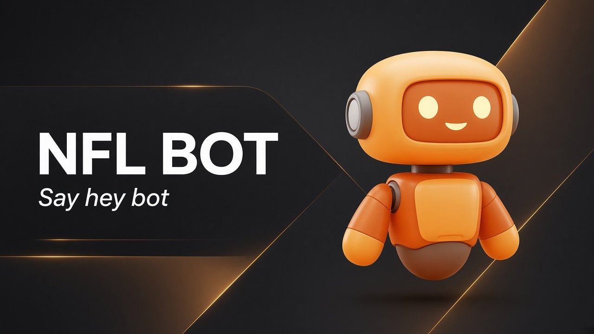
</p>

<h1 align="center">NFL BOT</h1>

<p align="center">
  <strong>A live AI health coach that stays quiet until you say <em>hey bot</em>.</strong><br/>
  Dark-bronze Flutter app · honest logs only · voice, food, training, water & recovery
</p>

<p align="center">
  <a href="https://arnold-rg.github.io/nfl-bot/"></a>
  <a href="https://arnold-rg.github.io/nfl-bot/app/"></a>
  <a href="https://github.com/Arnold-RG/nfl-bot"></a>
</p>

<p align="center">
  
  
  
  
</p>

---

## Why this exists

Most fitness apps greet you with a perfect week you never lived.  
**NFL BOT does the opposite.** Day one the diary is blank, the streak is zero, and Bot has nothing clever to say about calories you didn’t eat.

**Product rule:** if a number is on screen, you put it there — or your sensors did.

> Wellness guidance only — not medical diagnosis or treatment.  
> Trademark note: validate “NFL” branding before any commercial launch.

---

## Try it now (any phone)

| | Link |
|---|---|
| **Marketing site** (how it works + QR) | https://arnold-rg.github.io/nfl-bot/ |
| **Full web app** | https://arnold-rg.github.io/nfl-bot/app/ |
| **Source** | https://github.com/Arnold-RG/nfl-bot |

<p align="center">
  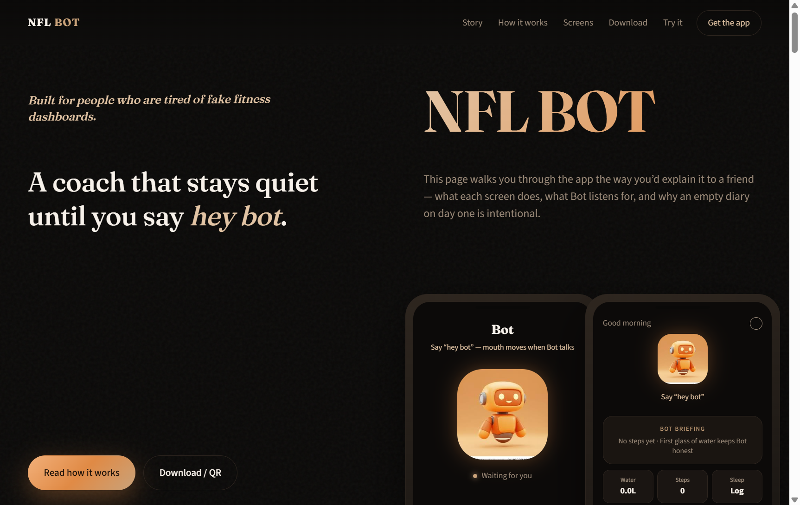
</p>

---

## Meet Bot

<p align="center">
  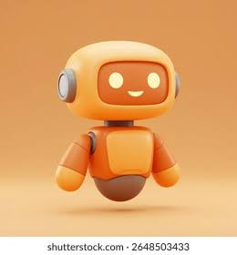
</p>

Bot is a **live cartoon coach** (not a stock photo). Head turns while thinking, mouth moves while speaking, leans in while listening. Wake him with **“hey bot”**, mute him in Account, or enable quiet hours after 21:00.

---

## How the app works

The coaching loop is intentionally simple:

```text
Wake Bot → log something real (meal · water · walk · set · sleep · mood)
        → briefings & answers update from that data
        → streak grows only on active days
```

### 1 · Today — honest home

Bot floats in the center. Briefing + next-best-move come only from live logs. Vitals open Water, Map, and Sleep.

<p align="center">
  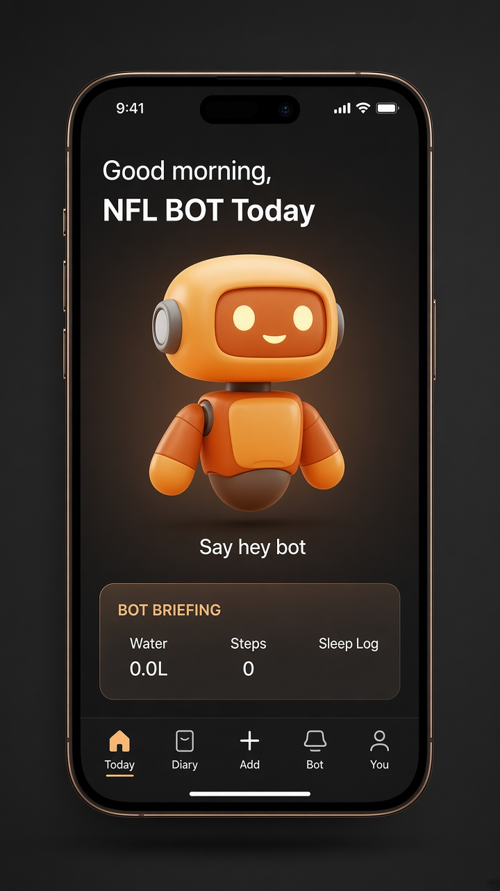
</p>

### 2 · Bot — voice coach

Say **hey bot** or tap Talk. Hands-free reopens the mic after each reply.

<p align="center">
  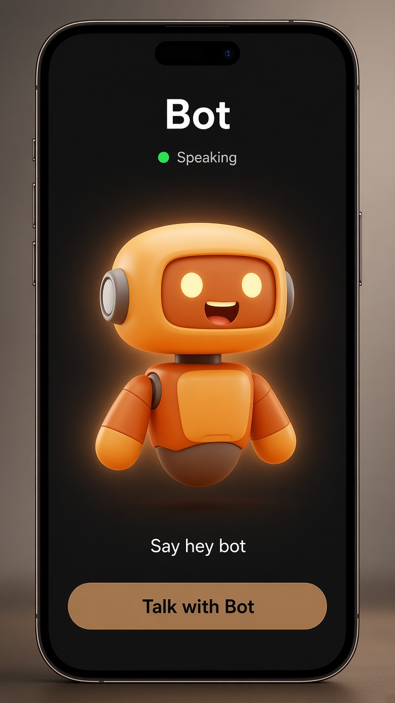
</p>

### 3 · Diary — scan → confirm

Camera plate vision suggests foods. **Nothing is saved until you confirm.** No demo meals on a fresh install.

<p align="center">
  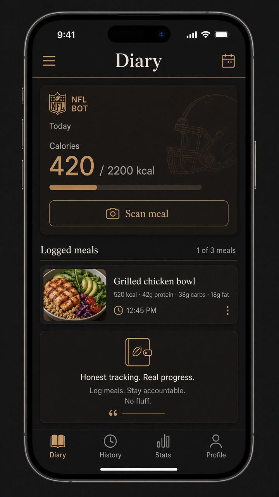
</p>

### 4 · Water · Map · Sleep

Hydration chips (+250 / +500 ml + workout sips), GPS track on OpenStreetMap (route, km, steps), sleep hours & quality for readiness.

<p align="center">
  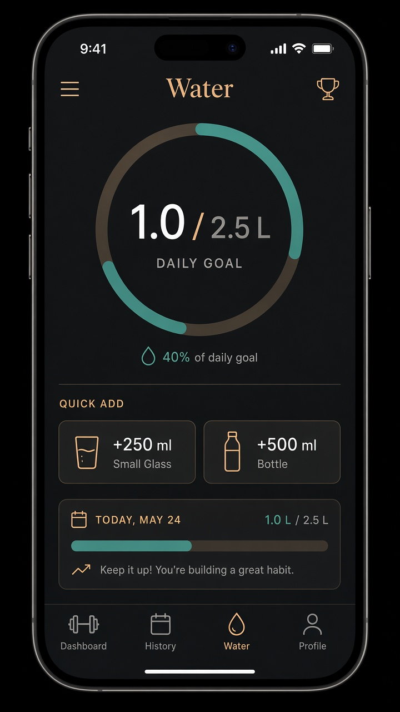
  &nbsp;
  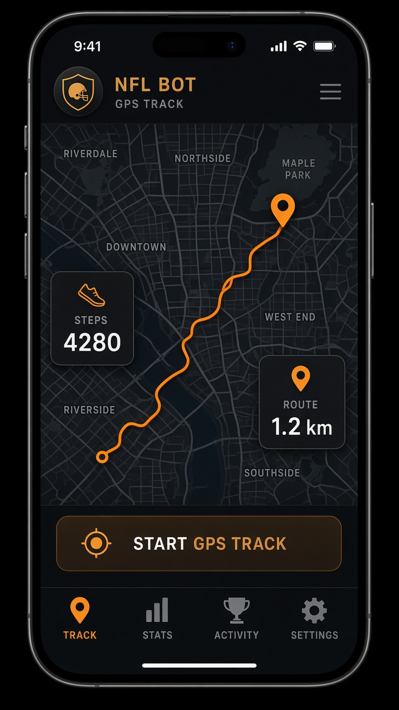
</p>

### 5 · Form demos — train with anatomy

Black stage, human figure, muscle glow, set dots, **LOG SET** — coach-app pattern, not a GIF library.

<p align="center">
  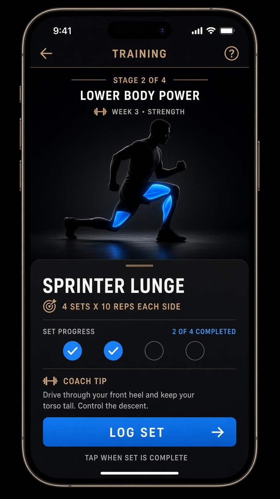
</p>

### 6 · You — readiness, mood, recap, account

Readiness from sleep + water + steps. Mood check-in (tone, not diagnosis). Reminders, progress photos, weekly calorie bars. Rebuilt Account: profile, voice, hands-free, quiet hours, coach voice, goals, watch, permissions.

<p align="center">
  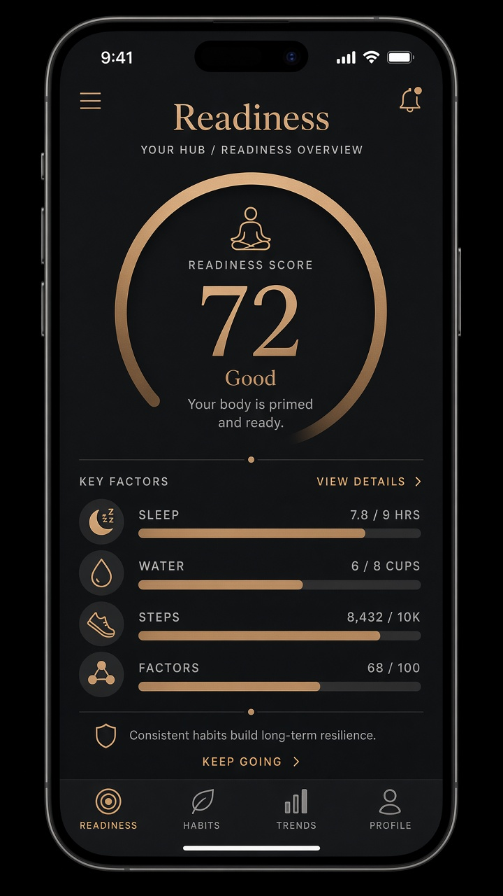
  &nbsp;
  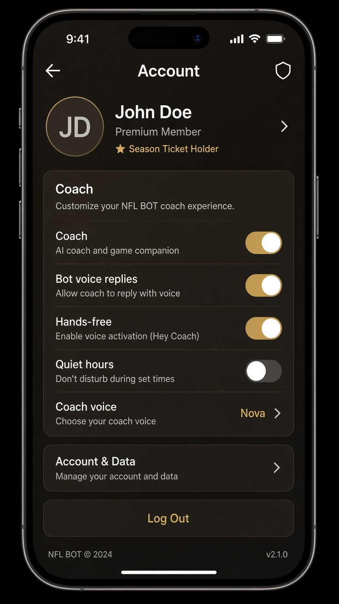
</p>

---

## Screen gallery

| Screen | What you see |
|--------|----------------|
| [Today](docs/screenshots/01-today-home.png) | Empty-until-real home + Bot |
| [Bot](docs/screenshots/02-bot-talking.png) | Live talking coach |
| [Water](docs/screenshots/03-water.png) | Daily + workout hydration |
| [Form](docs/screenshots/04-form-demo.png) | Anatomy demos + LOG SET |
| [Map](docs/screenshots/05-map-track.png) | GPS route + steps |
| [Readiness](docs/screenshots/06-readiness.png) | Honest score from inputs |
| [Diary](docs/screenshots/07-diary-scan.png) | Confirm-gated meal log |
| [Account](docs/screenshots/08-account.png) | Coach + profile controls |
| [Website](docs/screenshots/09-website-hero.png) | Public how-it-works site |

Full visual index → **[docs/SHOWCASE.md](docs/SHOWCASE.md)**

---

## What’s in this repository

```text
lib/                 Flutter app (shell, Bot, fuel, train, wellness, account)
assets/branding/     Bot mascot
website/             Marketing site (deployed to GitHub Pages)
docs/                Architecture, store drafts, screenshots
backend/             FastAPI companion (optional)
.github/workflows/   Pages deploy (site + Flutter web)
```

| Layer | Tech |
|-------|------|
| App | Flutter · Provider · speech_to_text · flutter_tts · image_picker · flutter_map · geolocator |
| Theme | Dark charcoal `#0A0908` · bronze `#C9A27A` · copper `#E08A45` |
| Android ID | `com.nfbot.nfbot_app` |
| iOS ID | `com.nfbot.nfbotApp` |

---

## Navigation map

```text
Today  ·  Diary  ·  Add (scan)  ·  Bot  ·  You
  │         │         │           │       │
  │         │         └─ Plate vision     ├─ Readiness / Mood
  │         └─ Confirmed meals            ├─ Water / Map / Form
  └─ Briefing · vitals · next move        ├─ Reminders / Photos / Recap
                                          └─ Account
```

---

## Quick start (local)

```bash
git clone https://github.com/Arnold-RG/nfl-bot.git
cd nfl-bot
flutter pub get
flutter run
```

**Optional local AI key** (never commit):

```bash
cp lib/config/local_secrets.example.dart lib/config/local_secrets.dart
# add your xAI / provider key
```

**Marketing site locally:**

```bash
cd website
python -m http.server 5500
# http://127.0.0.1:5500
```

---

## Documentation

| Doc | Purpose |
|-----|---------|
| [docs/SHOWCASE.md](docs/SHOWCASE.md) | Visual walkthrough of every surface |
| [docs/README.md](docs/README.md) | Docs hub |
| [docs/PRODUCT_BLUEPRINT.md](docs/PRODUCT_BLUEPRINT.md) | Product intent |
| [docs/ARCHITECTURE.md](docs/ARCHITECTURE.md) | Engines & platform |
| [docs/NUTRITION_FITNESS_LOOP.md](docs/NUTRITION_FITNESS_LOOP.md) | Fuel / diary loop |
| [docs/privacy_policy.html](docs/privacy_policy.html) | Privacy starter |

---

## Security

Do **not** commit:

- `lib/config/local_secrets.dart`
- `android/key.properties`, `*.jks`, `*.keystore`
- `.env` files, `google-services.json`

Public Pages builds use an empty secrets stub so the web demo compiles without keys.

---

## Author

Built by **[Arnold-RG](https://github.com/Arnold-RG)**  
Portfolio: [arnold-rg.github.io](https://arnold-rg.github.io)

---

## License

Source-available for learning and portfolio use. See [LICENSE](LICENSE).  
Not affiliated with the National Football League.
