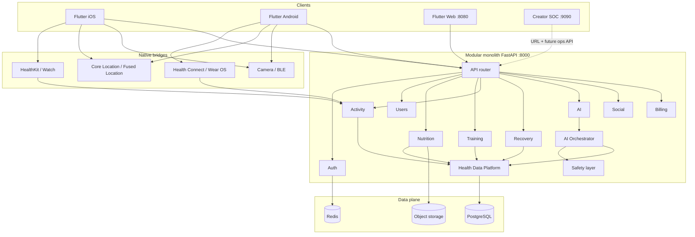

# NFL BOT — Technical Architecture

Engineer-facing companion to [PRODUCT_BLUEPRINT.md](./PRODUCT_BLUEPRINT.md). Describes system shape, Flutter module map, engine contracts, sync, API outline, Creator SOC boundary, and privacy.

---

## 1. System diagram



Text equivalent:

```text
Mobile / Web Flutter
   ├─ HealthKit / Health Connect / GPS / Camera (native)
   └─ HTTPS → FastAPI modular monolith (:8000)
                 ├─ Auth / Users / Nutrition / Training
                 ├─ Activity / Recovery / AI / Social / Billing
                 ├─ Health Data Platform (canonical profile + events)
                 ├─ AI Orchestrator + Safety
                 └─ PostgreSQL · Redis · Object storage

Creator SOC (:9090) ── URL / ops API only ──→ same backend (no shared Flutter UI)
```

---

## 2. Flutter module map (current `lib/`)

```text
lib/
├── main.dart
├── config/                 # app_config, routes, theme
├── core/
│   ├── data/               # catalogs (countries, currencies, languages, workouts)
│   ├── engines/            # activity, body, calorie, fasting, overload
│   ├── intelligence/       # readiness, sleep, anomaly, adaptive plan, coach knowledge
│   ├── l10n/
│   ├── models/             # user_profile, food, watch, subscription, health_intelligence
│   ├── network/
│   ├── platform/           # native bridge hooks
│   ├── providers/          # app_state
│   ├── services/           # AI coach, billing, watch, permissions, storage, telemetry…
│   ├── theme/
│   └── utils/
└── features/
    ├── account/
    ├── coach/              # AI coach hub
    ├── home/               # home hub + legacy presentation widgets
    ├── launch/
    ├── live/               # live voice stage
    ├── nutrition/
    ├── onboarding/
    ├── plate/              # food camera / plate
    ├── progress/           # scores, recovery, reports (proxy for Recovery UX)
    ├── shared/
    ├── shell/              # bottom navigation shell
    ├── train/
    └── watch/              # wearable connect
```

**Member app port (local):** typically `8080`.  
**Do not** embed Creator SOC inside Flutter tabs; link by URL only.

---

## 3. Health Data Platform responsibilities

The HDP is the **single write/read authority** for user health state.

| Responsibility | Detail |
|----------------|--------|
| Canonical profile | Persist/serve `HealthProfile` (personal, goals, activity, nutrition, training, recovery, AI profile) |
| Event ingestion | Accept `HealthEvent` from app, wearables, manual entry |
| Source priority | Resolve conflicting metrics using declared priority + confidence |
| Deduplication | Merge duplicate activities/workouts across sources |
| Derived state | Expose readiness, remaining calories, training load snapshots to engines |
| Consent tags | Attach purpose/consent category to stored fields where required |
| Audit trail | Optional processing status (`pending` / `verified` / `rejected`) for debugging |

Engines **must not** each maintain a private conflicting “truth” for the same metric.

---

## 4. Engine contracts

Contracts are logical; MVP may implement stubs that return deterministic placeholders.

### ActivityEngine
- **In:** step samples, GPS sessions, wearable activity events  
- **Out:** steps progress, distance, session summaries, NEAT calorie estimate, activity load  
- **Side effects:** emits events → HDP; notifies calorie/recovery consumers  

### TrainingEngine
- **In:** plan request, equipment, experience, last sets, RPE, recovery %  
- **Out:** session plan, substitutions, progressive overload prescription (deterministic)  
- **Safety:** pain/injury flags reduce intensity; no medical diagnosis  

### NutritionEngine
- **In:** food logs, barcode hits, vision estimates (user-editable), water, allergies  
- **Out:** diary day, macros vs targets, adaptive calorie suggestion (trend-based)  
- **Safety:** programmatic allergy blocks before LLM recipes  

### RecoveryEngine
- **In:** sleep, HR/HRV, training load, muscle group stress  
- **Out:** recovery %, readiness, muscle map, soft recommendations  

### AIIntelligence (orchestrator)
- **In:** user intent + HDP snapshot  
- **Out:** routed engine result and/or LLM explanation  
- **Must:** pass safety layer; prefer deterministic math for load/calories/overload  

### PersonalizationEngine
- **In:** goals, preferences, recommended-vs-actual outcomes  
- **Out:** updated AI profile, adjusted targets/plans  

### UXEngine (product surface)
- **In:** HDP + engine outputs + notification prefs  
- **Out:** Home cards, Morning AI, Now button, share cards, retention prompts  

---

## 5. Event flow and sync

```text
Device / User action
        ↓
Local store (offline queue)
        ↓
POST /activity|nutrition|training|recovery events
        ↓
Deduplicate + source priority
        ↓
Update HealthProfile projections
        ↓
Notify dependent engines (calories, recovery, AI)
        ↓
GET profile / today snapshots for UI
```

**Offline:** mutations queue with client IDs; sync reconciles by `(user_id, client_event_id)` and source priority.  
**Conflict rule:** higher priority source wins for the same metric window; never delete user diary rows without explicit user action.

---

## 6. API surface outline

Base URL (local): `http://localhost:8000`  
OpenAPI: `/docs` when running FastAPI.

| Module | Prefix | Purpose |
|--------|--------|---------|
| Health | `GET /health` | Liveness |
| Auth | `/auth` | Register, login, token refresh (stubs) |
| Users | `/users` | Profile CRUD, goals, consents |
| Nutrition | `/nutrition` | Diary, foods, water, targets |
| Training | `/training` | Plans, sessions, PRs, overload |
| Activity | `/activity` | Steps, sessions, GPS summaries |
| Recovery | `/recovery` | Sleep, readiness, muscle map |
| AI | `/ai` | Orchestrator, now, morning brief, chat |
| Social | `/social` | Friends, challenges (stubs) |
| Billing | `/billing` | Plan status, entitlements (stubs) |

Detailed paths: [API_CONTRACT.md](./API_CONTRACT.md).

---

## 7. Creator SOC boundary

| Product | Port | Stack | Coupling |
|---------|------|-------|----------|
| Member app | 8080 | Flutter | Calls member APIs |
| Creator SOC | 9090 | Static HTML/JS in `creator_soc/` | URL link + future ops/admin API |
| Backend | 8000 | FastAPI | Shared data plane |

- SOC is **not** a Flutter feature module.  
- Production: authenticate creators separately; never ship admin secrets in the member app.  
- See `creator_soc/README.md`.

---

## 8. Privacy and consent categories

| Category | Data examples | Default stance |
|----------|---------------|----------------|
| Account | email, auth identifiers | Required for sync |
| Body metrics | height, weight, age, sex | Required for meaningful targets; user-editable |
| Activity | steps, GPS traces | Optional; GPS precise location minimized/retained with clear policy |
| Nutrition | meals, photos | Optional; photos in object storage with deletion path |
| Training | workouts, RPE | Optional |
| Recovery / vitals | sleep, HR, HRV | Optional; sensitive — higher protection |
| AI interactions | chat, voice transcripts | Optional; retention limits; export/delete |
| Social | friends, challenge posts | Explicit opt-in |
| Billing | subscription status | Required for Pro; PCI via provider |
| Analytics | product events | Privacy-preserving; user controls |
| Employer / gym dashboards | aggregates | **No individual health** without explicit appropriate consent |

Medical disclaimer must appear in onboarding and AI surfaces. Allergy data is high-sensitivity and high-priority for safety rules.

---

## 9. Implementation notes for this repo

- Backend skeleton: `backend/app/` (modular routers + `HealthProfile` + orchestrator stubs).  
- Flutter engines already exist under `lib/core/engines/` and should converge on HDP event semantics over time.  
- Prefer extending the monolith modules before extracting microservices.  
